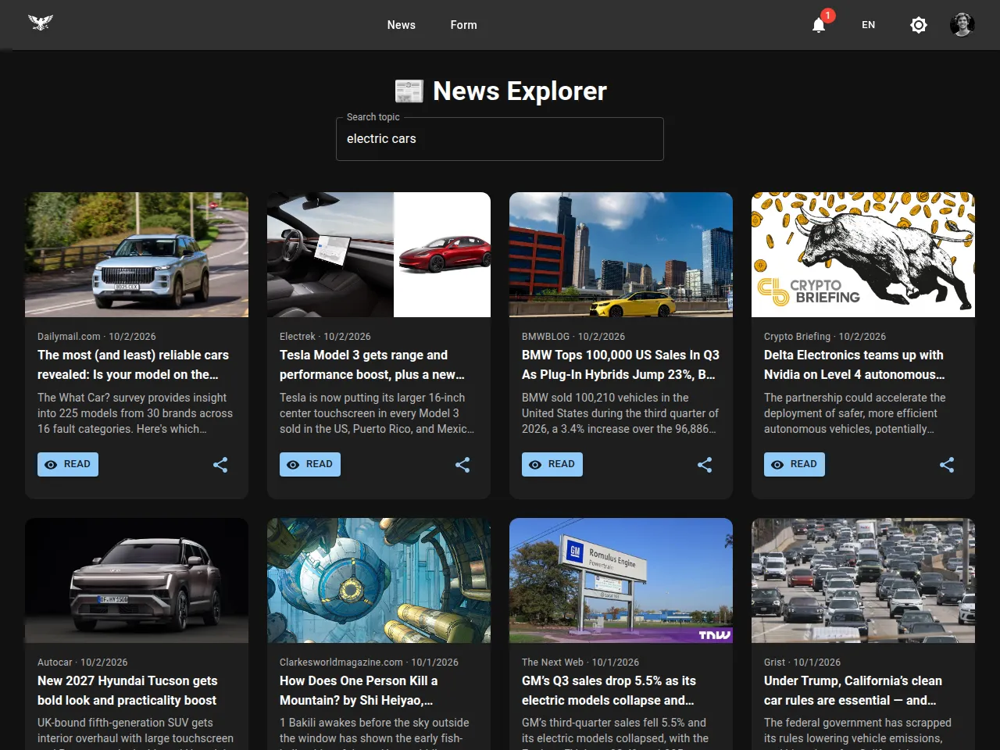
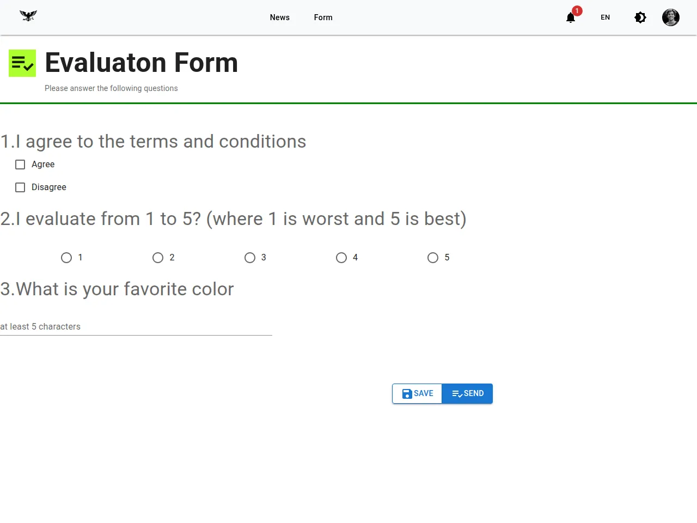

# News Explorer (React + Material UI)

A news search app built while learning Material UI at ITI. You search a topic and get the latest articles from
[NewsAPI](https://newsapi.org/) as cards you can open or share. The UI switches between light and dark mode and
between English and Arabic (right-to-left). A second page shows MUI form controls.


| Dark mode | Arabic (RTL) | MUI form |
|---|---|---|
|  |  |  |

## Features

- **Search** with a debounce: the request goes out when typing pauses (or on Enter), not on every key,
  which matters on NewsAPI's 100-requests-a-day free plan. Stale responses are dropped.
- **Suggestions**: matching headlines from the loaded results open the article directly.
- **Cards** with source, date, image and description; read or share (Web Share API, clipboard fallback).
- **Light/dark mode** through an MUI theme driven by Redux; **English/Arabic** switches the layout to RTL.
- Loading spinner and clear errors for a missing key or an exhausted daily limit.
- Responsive grid and a drawer menu on phones.

## Tech stack

React 19 · Vite · Material UI 7 (Emotion) · Redux Toolkit · React Router 7 · Axios

## Running locally

```bash
npm install
cp .env.example .env    # put your free NewsAPI key in NEWSAPI_KEY
npm run dev             # http://localhost:5173
```

The key stays on your machine: the Vite dev server proxies `/newsapi` to NewsAPI and adds the key server-side,
so it never appears in the browser bundle.

**Why there is no live demo:** NewsAPI's free plan only accepts requests from `localhost`, so a static deployment
(GitHub Pages) can't fetch articles. Running it locally as above works.

## Project structure

```
src/
├── pages/Home.jsx            News search
├── pages/Form.jsx            MUI form controls demo
├── components/               Navbar, drawer, menus, form controls
├── AxiosInstance/            Axios client for the /newsapi proxy
├── Redux-Toolkit/Store.jsx   Theme and language slices
└── Locals/                   English and Arabic strings
```

## Changes after the course

- The API key was hardcoded in the source and sent through the public `cors-anywhere` demo proxy, which no longer
  works; requests now go through a local proxy that keeps the key out of the bundle.
- The deployed site showed a blank page: the router had no `basename` for the GitHub Pages sub-path, and the logo
  paths were absolute.
- Dark mode toggled Bootstrap classes that weren't installed; it now uses MUI's theme (`palette.mode`).
- Every keystroke sent a request; search is now debounced.
- The grid used MUI v5 `item`/`xs` props that MUI v7 ignores; it now uses `size`.
- Removed the Vite starter CSS, the dead About/Contact links and bookmark button; the mobile menu button now opens
  a drawer.
